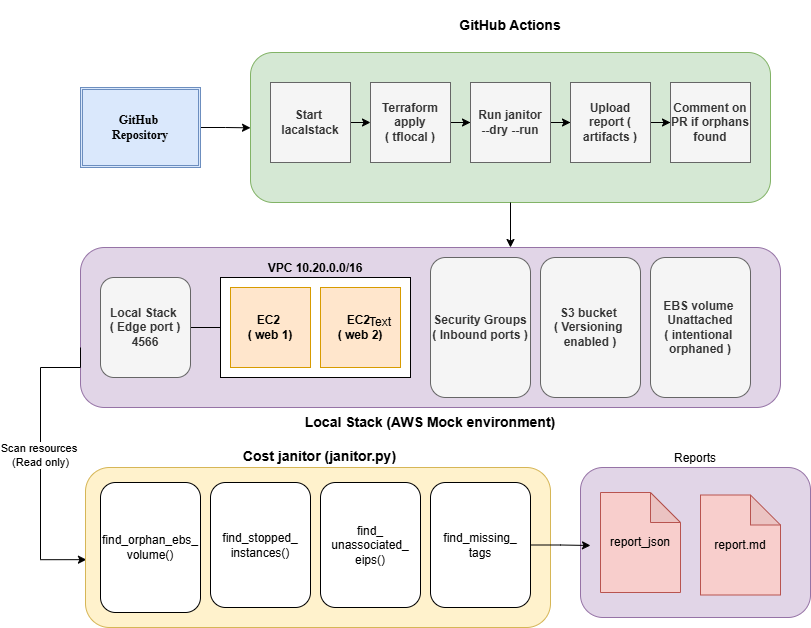

# NimbusKart-Cost-Janitor

## Overview

NimbusKart is a cloud cost optimization project simulating a real-world FinOps problem, where AWS costs increased from $400 to $2,100/month due to orphaned resources.The project provisions infrastructure locally using Terraform and LocalStack, avoiding the need for a real AWS account. A Python-based “Cost Janitor” script scans the environment to detect unused resources such as unattached EBS volumes, stopped EC2 instances, unused Elastic IPs, and untagged resources.GitHub Actions automates the workflow by running infrastructure deployment and executing janitor scans during pull requests, generating cost reports automatically.


## How to run locally

**Prerequisites:** Docker Desktop, Python 3.10+, Terraform 1.15+

```bash
# 1. Clone the repo
git clone https://github.com/itzrax/DevOps-Engineer-Assignment.git
cd DevOps-Engineer-Assignment

# 2. Start LocalStack
docker run -d -p 4566:4566 --name localstack localstack/localstack:3.8.1

# 3. Install terraform-local
pip install terraform-local

# 4. Apply Terraform infrastructure
cd terraform
tflocal init
tflocal apply -auto-approve

# 5. Install janitor dependencies
cd ../janitor
pip install -r requirements.txt

# 6. Run the janitor in dry-run mode
python3 janitor.py --dry-run

# 7. To actually delete orphaned resources
python3 janitor.py --delete
```

## Architecture




## Decisions & deviations

1. SSH is currently open to 0.0.0.0/0 because it was part of the assignment requirement. I know this is not secure in real production environments, so I exposed it as a variable (ssh_cidr) so it can easily be restricted later without changing the code.

2. I commented out the S3 lifecycle configuration because LocalStack Community Edition kept timing out while applying it. I left the code and notes there since the configuration works properly in real AWS.

3. I did not use remote Terraform state because the goal was to keep the project simple and fully runnable locally without requiring AWS credentials. In a real production setup, I would use an S3 backend with DynamoDB locking.

4. LocalStack was pinned to version 3.8.1 because newer versions require a paid subscription for some services used in this assignment. Version 3.8.1 was the most stable free version for this setup.

5. safe_to_auto_delete is intentionally set to false for all resources because automatically deleting cloud resources without proper tagging rules can be risky. I wanted the janitor tool to only report findings instead of deleting anything automatically.

## Trade-offs :

If I had more time, I would improve the project further by:

- Adding proper unit tests using moto for mocking AWS services and testing the janitor functions.

- Extending orphan detection to include unused RDS snapshots and outdated AMIs.

- Adding Slack or email notifications so reports can be sent directly to the FinOps or DevOps team.

- Setting up a production style Terraform backend using S3 and DynamoDB state locking.

- Finding a workaround for the S3 lifecycle configuration issue in LocalStack or testing it using a paid LocalStack version.

## AI usage disclosure

- AI tools were used mainly for speeding up Terraform structure setup, GitHub Actions workflow generation, debugging LocalStack issues, and organizing the Python janitor script.

- One issue caused by AI was an incorrect report.json schema that did not fully match the assignment requirements. I fixed it manually after rechecking the assignment specification carefully.

- The architecture decisions, security considerations, LocalStack troubleshooting, and final adjustments were done manually while testing and running the project locally.

- While setting up LocalStack, I ran into Docker `--rm` container cleanup issues where containers stopped unexpectedly during repeated testing. This was solved manually through debugging and log inspection.
